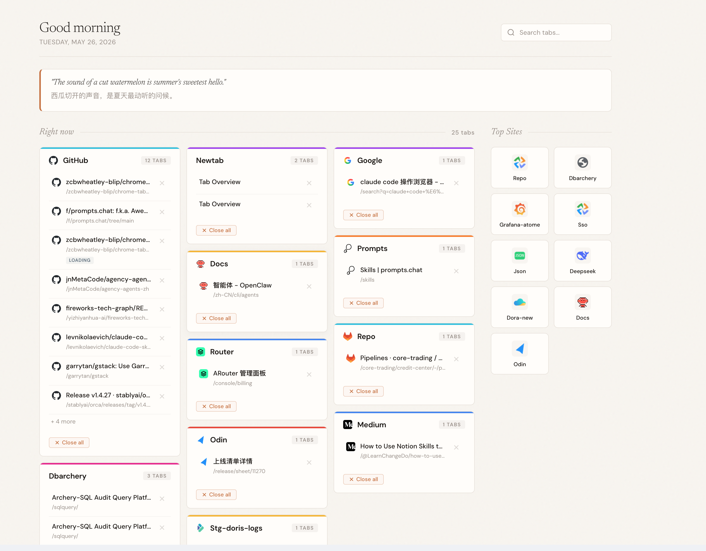
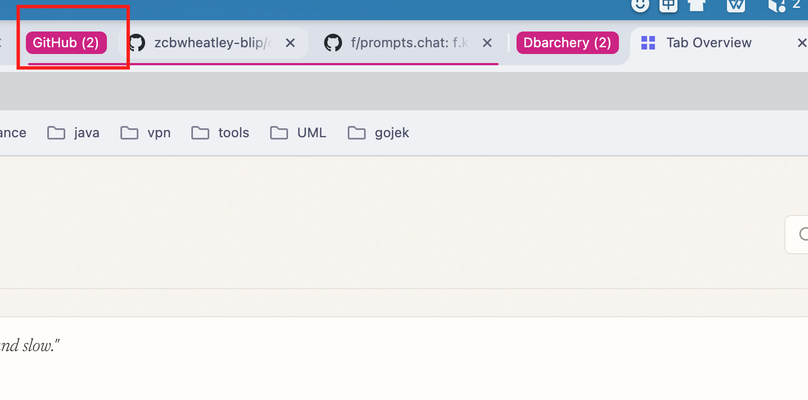

# Tab Overview

A Chrome extension that provides a beautiful tab manager with automatic domain grouping, daily quotes, and quick access to frequently visited sites.

## Features

### Tab Overview Dashboard
- **Masonry layout** — Tabs grouped by domain in a multi-column waterfall grid
- **Two-line tab details** — Each tab shows title, URL path, and status badges (Pinned / Playing / Loading)
- **Color-coded cards** — Each domain card has a unique colored accent bar for visual distinction
- **Real-time search** — Filter tabs by title or URL with instant results
- **Tab management** — Click to switch, close individual tabs, or close all tabs in a domain group
- **Hover preview** — Hover over any tab to see full details in a floating popup

### Daily Quote
- **Bilingual quotes** — English + Chinese daily sentence powered by [iCIBA API](http://open.iciba.com/dsapi/)
- **Fallback support** — Built-in offline quotes when API is unavailable

### Auto Tab Grouping
- **Automatic domain grouping** — Tabs from the same domain are automatically grouped in Chrome's native tab bar
- **Rainbow color assignment** — Groups get colors in sequential rainbow order (blue, red, yellow, green, pink, purple, cyan, orange)
- **Count-based titles** — Group titles show domain name with tab count, e.g. `GitHub (5)`
- **Smart cleanup** — Groups are automatically removed when only one tab remains

### Quick Access Sidebar
- **Top Sites** — Right sidebar shows your most visited sites in a card grid
- **One-click open** — Click any site to open in a new tab
- **Deduplicated** — Same-domain sites are merged into a single entry

## Screenshots

### Overview Dashboard



### Auto Tab Grouping



## Triggers

- **Keyboard shortcut**: `Cmd+Shift+E` (Mac) / `Ctrl+Shift+E` (Windows/Linux)
- **Toolbar icon**: Click the extension icon
- **New tab page**: Replaces Chrome's default new tab page

## Installation

### From Source (Developer Mode)

1. Clone this repository:
   ```bash
   git clone https://github.com/zcbwheatley-blip/chrome-tab-overview.git
   ```

2. Open Chrome and navigate to `chrome://extensions/`

3. Enable **Developer mode** (toggle in top-right corner)

4. Click **Load unpacked** and select the project folder

5. The extension is now active — open a new tab to see the overview

### Permissions

| Permission | Purpose |
|------------|---------|
| `tabs` | Access tab information (title, URL, favicon) |
| `tabGroups` | Create and manage native tab groups |
| `topSites` | Display most frequently visited sites |
| `favicon` | Load website favicons |
| `host_permissions` | Fetch daily quotes from iCIBA API |

## Keyboard Shortcuts

| Shortcut | Action |
|----------|--------|
| `Cmd+Shift+E` / `Ctrl+Shift+E` | Open Tab Overview |
| `/` | Focus search bar |
| `Escape` | Clear search and blur |

## Tech Stack

- **Pure JavaScript** — No build step, no framework, no dependencies
- **Chrome Extension Manifest V3**
- **CSS Custom Properties** — Design tokens for consistent theming
- **Google Fonts** — Newsreader (serif headings) + DM Sans (body)
- **Chrome APIs** — tabs, tabGroups, topSites, favicon

## Design

Visual style inspired by [tab-out](https://github.com/zarazhangrui/tab-out) — warm paper aesthetic with subtle noise texture, serif/sans-serif type pairing, and editorial card layout.

Key design choices:
- Warm color palette (`#f8f5f0` paper, `#1a1613` ink, `#c8713a` amber accent)
- SVG fractal noise texture overlay
- Staggered fade-up entrance animations
- Masonry card grid with colored accent borders

## Project Structure

```
tab-overview/
├── manifest.json          # Extension configuration
├── service-worker.js      # Background: auto-grouping, message handling
├── overview/
│   ├── overview.html      # Main UI page
│   ├── overview.js        # App logic: rendering, search, interactions
│   └── overview.css       # Styles (warm paper aesthetic)
└── icons/
    ├── icon16.png
    ├── icon48.png
    └── icon128.png
```

## Acknowledgments

- UI style reference: [tab-out](https://github.com/zarazhangrui/tab-out) by [@zarazhangrui](https://github.com/zarazhangrui)
- Daily quotes: [iCIBA Open API](http://open.iciba.com/dsapi/)
- Fonts: [Newsreader](https://fonts.google.com/specimen/Newsreader) & [DM Sans](https://fonts.google.com/specimen/DM+Sans)

## License

MIT
