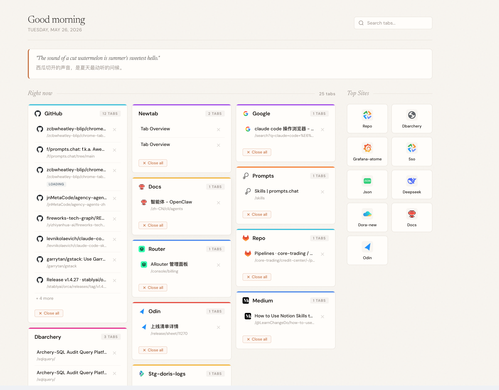
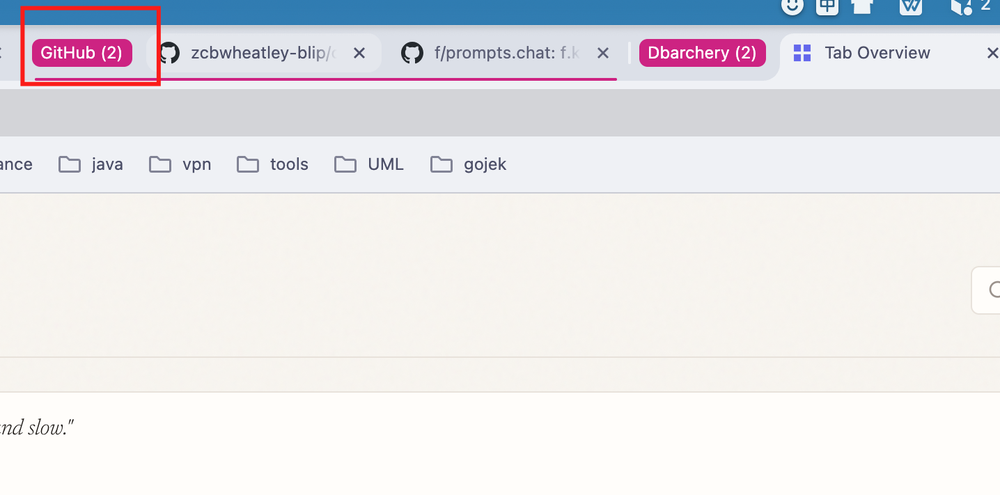

# Tab Overview

A Chrome extension that provides a beautiful tab manager with automatic domain grouping, a VertiTab-style side panel, and quick access to frequently visited sites.

## Features

### Side Panel (VertiTab-style)

- **Domain-grouped tab list** — Tabs grouped by domain in every browser window; multi-tab domains get colored pill headers (Chrome tab-group style, 8 rotating colors)
- **Two-line tab rows** — Title on top, muted `domain · relative time` subtitle below, with the tab's window position number
- **Guide line** — Each group's tab list is connected by a vertical guide line in the group's color
- **Multi-window support** — One collapsible section per browser window (`Current`, `Window 2`, ...), each with grouped/standalone tab counters and a window switcher popover (switch focus, close window)
- **Native group sync** — Expanding/collapsing a group in the panel folds/unfolds the same group in Chrome's tab strip, and vice versa
- **Quick Access** — Collapsible favicon grid of pinned sites above the tab list; add sites via the toolbar `+` button
- **Two view modes** — Compact list or gallery (favicon cards in 2/3/4 columns), persisted across sessions
- **Tab search** — Filter tabs by title or URL; matching groups auto-expand
- **Dedupe with badge** — Bottom bar shows a live badge with the number of duplicate tabs; one click closes them all
- **Tab actions** — Reload or close any tab on row hover; the active tab is highlighted and stays in window order (no reordering on click)

### Appearance Settings

- **Three themes** — Sage (default), Light, and Dark
- **Accent colors** — Amber / blue / green / rose / purple
- **List styling** — Icon size (S/M/L) and shape (circle / rounded / square), title size / weight / line count, subtitle visibility
- **Density** — Cozy or compact row spacing
- **Gallery columns** — 2 / 3 / 4
- All settings persist via `chrome.storage.local` and apply live

### Overview Dashboard (New Tab)

- **Masonry layout** — Tabs grouped by domain in a multi-column waterfall grid
- **Two-line tab details** — Each tab shows title, URL path, and status badges (Pinned / Playing / Loading)
- **Color-coded cards** — Each domain card has a unique colored accent bar
- **Real-time search** — Filter tabs by title or URL with instant results
- **Tab management** — Click to switch, close individual tabs, or close all tabs in a domain group
- **Hover preview** — Hover over any tab to see full details in a floating popup
- **Quick Links** — Manually curated sites with drag-to-reorder, shared with the side panel's Quick Access

### Auto Tab Grouping

- **Automatic domain grouping** — Tabs from the same domain are automatically grouped in Chrome's native tab bar
- **Rainbow color assignment** — Groups get colors in sequential rainbow order (blue, red, yellow, green, pink, purple, cyan, orange)
- **Count-based titles** — Group titles show domain name with tab count, e.g. `GitHub (5)`
- **Smart cleanup** — Groups are automatically removed when only one tab remains

## Screenshots

### Overview Dashboard



### Auto Tab Grouping



## Triggers

- **Keyboard shortcut**: `Cmd+Shift+E` (Mac) / `Ctrl+Shift+E` (Windows/Linux) — open the side panel
- **Toolbar icon**: Click the extension icon to toggle the side panel
- **New tab page**: Replaces Chrome's default new tab page with the dashboard

## Installation

### From Source (Developer Mode)

1. Clone this repository:
   ```bash
   git clone https://github.com/zcbwheatley-blip/chrome-tab-overview.git
   ```

2. Open Chrome and navigate to `chrome://extensions/`

3. Enable **Developer mode** (toggle in top-right corner)

4. Click **Load unpacked** and select the project folder

5. The extension is now active — click the toolbar icon for the side panel, or open a new tab for the dashboard

> Requires Chrome 114+ (Side Panel API).

### Permissions

| Permission | Purpose |
|------------|---------|
| `tabs` | Access tab information (title, URL, favicon, position) |
| `tabGroups` | Create and manage native tab groups, sync collapse state |
| `storage` | Persist Quick Links and appearance settings |
| `favicon` | Load website favicons |
| `sidePanel` | Display the tab manager in Chrome's side panel |

## Project Structure

```
tab-overview/
├── manifest.json          # Extension configuration
├── service-worker.js      # Background: auto-grouping, message handling, side panel behavior
├── shared.js              # Shared helpers (domain extraction, display names)
├── sidepanel/
│   ├── sidepanel.html     # Side panel page
│   ├── sidepanel.js       # Panel logic: grouping, windows, settings, switcher
│   └── sidepanel.css      # Panel styles (themes, pills, sections)
├── overview/
│   ├── overview.html      # New tab dashboard
│   ├── overview.js        # App logic: rendering, search, interactions
│   └── overview.css       # Styles (warm paper aesthetic)
└── icons/
    ├── icon16.png
    ├── icon48.png
    └── icon128.png
```

## Acknowledgments

- Side panel UI inspired by [VertiTab](https://chromewebstore.google.com/detail/vertitab-%E2%80%93-vertical-tab-m/chejfhdknideagdnddjpgamkchefjhoi)
- Dashboard UI style reference: [tab-out](https://github.com/zarazhangrui/tab-out) by [@zarazhangrui](https://github.com/zarazhangrui)
- Fonts: [Newsreader](https://fonts.google.com/specimen/Newsreader) & [DM Sans](https://fonts.google.com/specimen/DM+Sans)

## License

MIT
